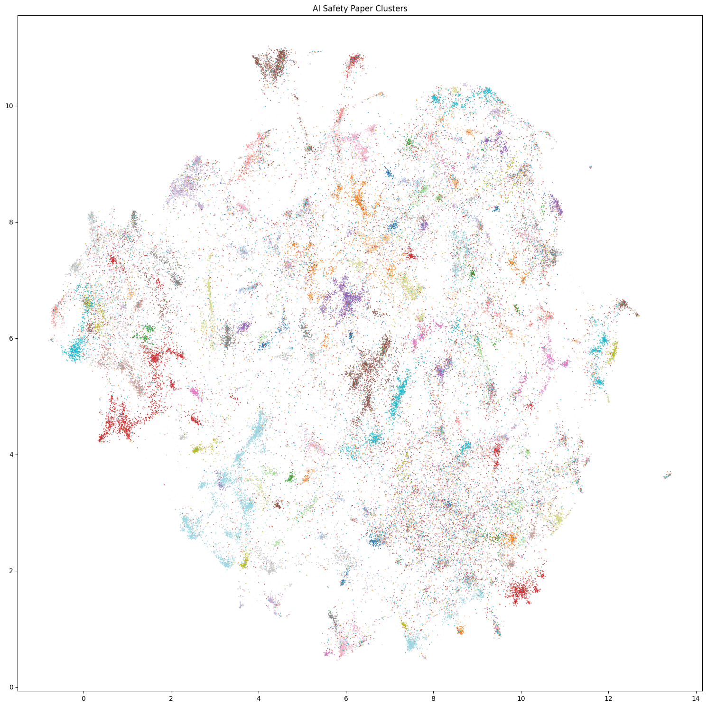
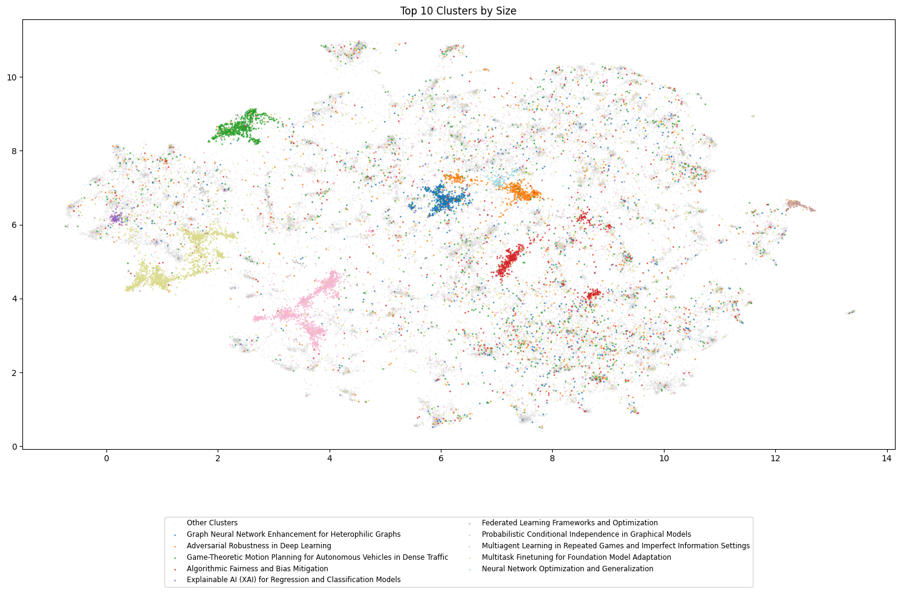
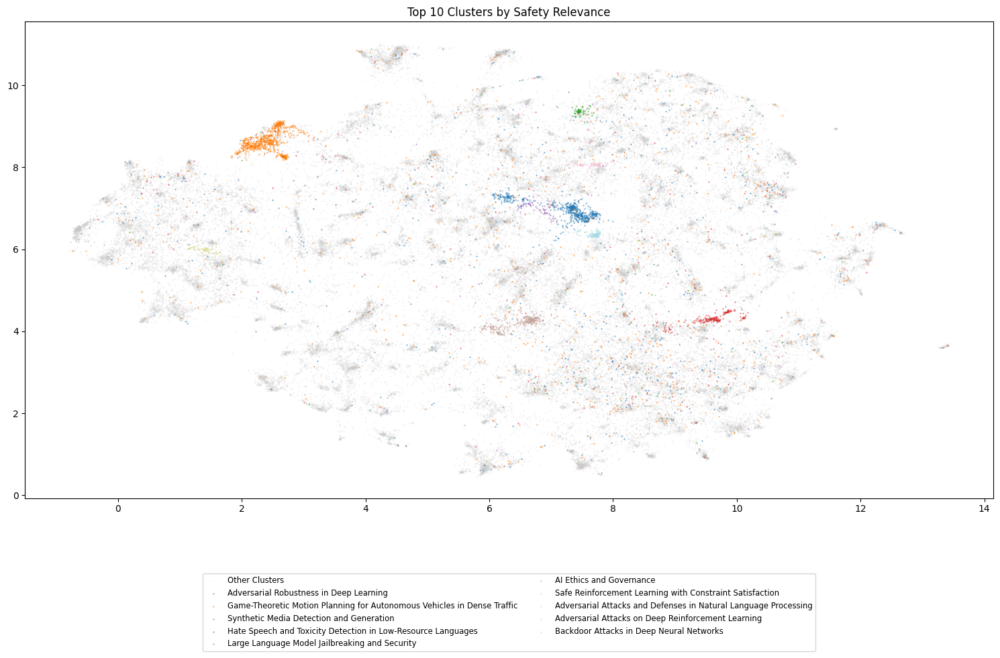
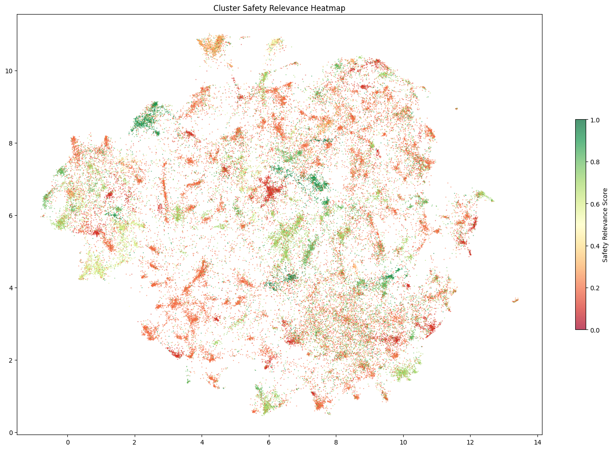
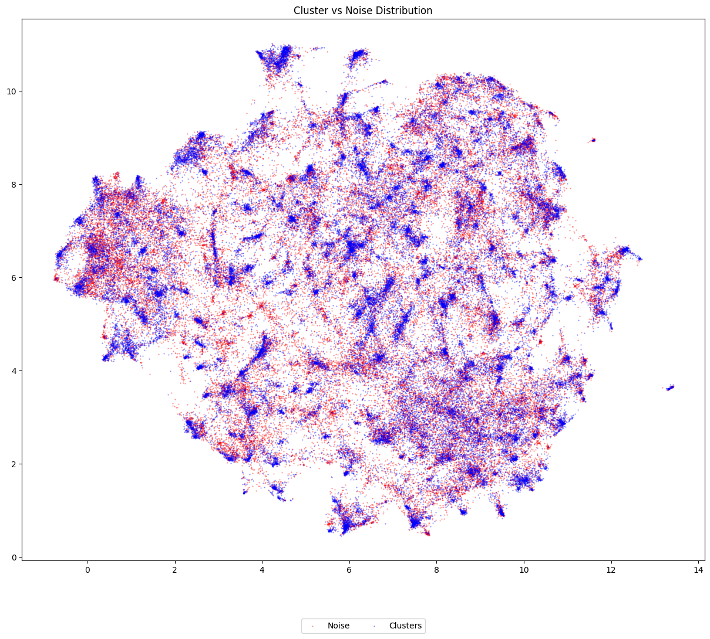

# AI Safety Landscape

Goal: create a visualization of AI Safety research papers using an unsupervised clustering and labeling approach.

## Overview

I was trying to understand how all the different research areas in AI Safety fit together, and I came across the *Future of Life Institute*'s [AI Safety Landscape](https://futureoflife.org/valuealignmentmap/). It's a great visualization, but unfortunately it's quite out of date as it was published in 2017 and hasn't been updated since. Furthermore, it seems it was created manually, but I don't have the expertise to replicate that, and I think given the expansion of the field since, it would be great to have an automated, scalable approach. 
This led me to a tutorial from the *Programming Historian*, [Clustering and Visualising Documents using Word Embeddings](https://programminghistorian.org/en/lessons/clustering-visualizing-word-embeddings), where the authors uses word embeddings and clustering algorithms to identify groups of similar documents in a corpus of approximately 9,000 academic abstracts. However, they rely on the Dewey Decimal Classification (DDC) as ground truth labels, which are very coarse-grained and not suitable for this use case.
My idea was thus to combine the embedding and clustering approach, but use an LLM to label the clusters.

## Pipeline

### Phase 1: Data Collection

I decided to focus solely on arXiv papers, as they provide an easy to use [OAI-PMH endpoint](https://info.arxiv.org/help/oa/index.html) for [bulk metadata harvest](https://info.arxiv.org/help/bulk_data.html) and include many papers in the field. They provide two metadata formats, `arXiv` and `arXivRaw`. Ideally, `arXiv` would be sufficient, as it has the advantage of separating out authors, but they don't clearly mark withdrawn papers, so I also harvested the `arXivRaw` metadata which includes all the versioning information, which can be used to infer their withdrawn status. I could have probably skipped this step, however at the time I thought I might use the full paper text (also available with public APIs as a TeX source), but eventually dropped that idea. At this stage, I also normalize the authors' names (there are some inconsistencies in suffixes such as Jr. and Sr., for example). All the data is stored in a PostgreSQL database. At the time of collection, there were 712,724 CS papers in the arXiv database. 

### Phase 2: Embedding Generation

Based on the [Massive Text Embedding Benchmark (MTEB) leaderboard](https://huggingface.co/spaces/mteb/leaderboard), `voyage-3-m-exp` is at the top of the ArxivClusteringP2P task, which aims to cluster papers based on their title and abstracts to assign them an arXiv category. While we aim for much more granularity, this is a good starting point, and the voyage embeddings are very high quality in general. The [`voyage-3-m-exp` page](https://huggingface.co/voyageai/voyage-3-m-exp) says that "voyage-3-large is highly recommended and likey strictly better than voyage-3-m-exp", so I selected the `voyage-3-large` model, which can output 2048-dimensional embeddings. At the time of writing, Voyage AI offer [200M free tokens](https://docs.voyageai.com/docs/pricing#text-embeddings), which was more than enough for this project. At this stage, I also wanted to start filtering papers, as 700K was probably too much and I was only really interested in AI safety papers. Thus, I only included papers with `cs.AI` as one of their categories. I only realized later that **this was a major mistake**, as many AI safety papers are not classified under `cs.AI`, but rather under `cs.LG` ('Machine Learning'). For example, the ["AI Control: Improving Safety Despite Intentional Subversion"](https://arxiv.org/abs/2312.06942) paper is classified solely under `cs.LG`. In any case, there were 112,313 `cs.AI` papers, which resulted in 28,677,566 tokens for when embedding their concatenated title and abstract.

> I initially tried to use [ModernBERT](https://huggingface.co/blog/modernbert), but the resulting embeddings were of much lower quality: the range of similarities between papers was much smaller. I suspect it hasn't been optimized for a downstream clustering task as much. 

### Phase 3: Clustering

I selected [HDBSCAN](https://hdbscan.readthedocs.io/en/latest/) (Hierarchical Density-Based Spatial Clustering of Applications with Noise) as a clustering algorithm. It has several advantages:
- **It can provide a hierarchical clustering**, which would theoretically allow us to create a taxonomy of AI safety research, mirroring the FLI's AI Safety Landscape.
- There is no need to specify the number of clusters beforehand.
- Clusters can be of varying densities, accounting for mainstream or niche research areas naturally.
- It has built-in noise detection.
- It excels at clustering high-dimensional data.
- Considered SOTA in for many clustering tasks.

#### Dimensionality Reduction with UMAP

To improve accuracy of clustering tasks, a dimensionality reduction is often applied as a preprocessing step, as HDBSCAN is still sensitive to the curse of dimensionality. I used [UMAP](https://umap-learn.readthedocs.io/en/latest/) (Uniform Manifold Approximation and Projection), as it's fast, preserves the local and global structure of the data, and is generally well-suited to a downstream HDBSCAN clustering.

#### Hyperparameter Tuning

I used [optuna](https://optuna.readthedocs.io/en/stable/) for hyperparameter optimization. It allows multiprocessing and can connect to a database backend, which was helpful for resuming tasks. Using the tutorials from [HDBSCAN's documentation](https://hdbscan.readthedocs.io/en/latest/parameter_selection.html) and UMAP ([1](https://umap-learn.readthedocs.io/en/latest/parameters.html) and [2](https://umap-learn.readthedocs.io/en/latest/clustering.html#umap-enhanced-clustering)), I selected the following hyperparameters to optimize:

- `use_umap` (range: `[True, False]`): whether to use UMAP for dimensionality reduction. I was curious to see if it would improve the clustering results, as HDBSCAN can supposedly handle high-dimensional data (*indeed, UMAP reduction helped*)
- `min_cluster_size` (range: `[20, 100]`): the minimum number of points in a cluster, this is the primary parameter for HDBSCAN.
- `min_samples` (range: `[5, 50]`): provides a measure of how conservative the clustering is, the higher it is, the more points will be considered noise.
- `cluster_selection_epsilon` (range: `[0.0, 0.5]`): allows merging of micro-clusters when min_cluster_size is low. 
- `n_components` (range: `[15, 100]`): the number of dimensions in the UMAP embedding.
- `n_neighbors` (range: `[30, 100]`): the number of neighbors to use in the UMAP embedding.

The following hyperparameters were kept constant:
- `metric = 'cosine'`: the metric to use for the UMAP embedding. `cosine` is standard for text embeddings/semantic similarity.
- `min_dist = 0.0`: the minimum distance between points in the UMAP embedding. As per the tutorial, for a downstream clustering task, it is best to set this to 0.0.
- `cluster_selection_method='leaf'`: the method to use for cluster selection. `eom` (Excess of Mass) is the default, but it has a tendency to pick one or two large clusters and then a number of small extra clusters. Instead, a better option is to select 'leaf' as a cluster selection method. This will select leaf nodes from the tree, producing many small homogeneous clusters, wnich is a better fit for granular research areas.

#### Objective Function

For evaluating cluster quality, I selected the [Density-based Clustering Validation Index (DBCVI)](https://hdbscan.readthedocs.io/en/latest/api.html#hdbscan.validity.validity_index) as the optimization objective, which as the name implies is specifically designed for density-based clustering. More precisely, `hdbscan` provides a `_relative_validity` attribute that is a fast approximation suitable for comparing results. It had to be reimplemented to work with cuML's GPU library but the effort was minimal with the source code. I rejected other metrics often used for clustering tasks, like Ball Hall, Davies Bouldin, Calinski Harabasz, Silhouette, and R-squared indices as they make assumptions such as spherical clusters or equal densities that I wasn't sure would align with the semantic structure of academic papers. I also considered ['trustworthiness'](https://docs.rapids.ai/api/cuml/stable/api/#cuml.metrics.trustworthiness.trustworthiness) as a metric specifically for evaluating UMAP reduction quality, but given that UMAP quality by itself was not the objective, and that I wanted to verify that using was actually better, I only saved it as a metric and did not use it for optimization.

#### Optimization Results

The best trial found was # 451, with a relative validity of 0.294. The parameters used were:
```json
{
    "use_umap": true,
    "n_components": 37,
    "n_neighbors": 48,
    "min_cluster_size": 96,
    "min_samples": 21,
    "cluster_selection_epsilon": 0.166
}
```

> Given that the min_cluster_size is so close the the end of the range, it suggests that a better clustering could have been found with an expanded range. 

#### Clustering Results

HDBSCAN identified 153 clusters, which is about expected given all `cs.AI` papers were clustered, and a high-granularity was sought. However, a relatively high noise+ ratio of 49.57% indicates that about half of the papers couldn't be confidently assigned to any cluster. While this could mean either emerging research areas or papers that bridge multiple domains, it's more likely that further work should be done on the clustering parameters. The clusters also show considerable variation in size (standard deviation of 402 papers) with a size ratio of 29.6 between the largest and smallest clusters. This could be a mix of the presence of both mainstream research areas and more specialized niches, as well as insufficiently granular clustering. The average cluster probability of 0.43 (±0.45) indicates moderate confidence in the cluster assignments, while the mean persistence of 0.125 suggests the clusters are reasonably stable. The trust score of 0.66 for the UMAP dimensionality reduction demonstrates that the lower-dimensional representation preserved a good portion of the original semantic relationships between papers. The relative validity of 0.2943 cannot be used as a measure of the quality of the clustering directly, and a full score needs to be computed.

> I had issues calculating the full DBCVI score. I suspect there was some bug in how the study artifact data was stored in the database, and a re-clustering might be needed.

### Phase 4: Labeling

I used Gemini 1.5 Flash with structured output to label the clusters. I also took the opportunity to add a relevance score to the labels, so that labels could then be filtered for a final visualization. The prompt used was:

```
You are an expert in AI safety and machine learning. Your task is to generate precise technical labels for clusters of academic papers related to AI research.

I will provide the ten papers most representative of the cluster (closest to the cluster centroid).

Review these papers and provide:
1. A specific technical category that precisely describes the research area represented by this cluster
2. A relevance score (0-1) indicating how relevant this research area is to AI safety

Guidelines:
- Use precise technical terminology
- Categories should be specific enough to differentiate between related research areas yet broad enough to actually group papers (e.g. "Reward Modeling for RLHF" rather than "Reinforcement Learning" or "Regularizing Hidden States Enables Learning Generalizable Reward Model for RLHF")
- Consider both direct and indirect relevance to AI safety

Papers to analyze:
```
Then, a batch of 10 representative papers, with titles and abstracts, were provided. These papers chosen were those closest to the cluster centroid.

## Results

Full label tables are available in [`cluster_results.md`](cluster_results.md).

### Top 20 Clusters by Size

| Size | Label | Safety Relevance |
|------|-------|------------------|
| 2844 | Multiagent Learning in Repeated Games and Imperfect Information Settings |       0.70       |
| 2262 | Explainable AI (XAI) for Regression and Classification Models |       0.80       |
| 2221 | Probabilistic Conditional Independence in Graphical Models |       0.20       |
| 1593 | Game-Theoretic Motion Planning for Autonomous Vehicles in Dense Traffic |       0.90       |
| 1375 | Federated Learning Frameworks and Optimization |       0.70       |
| 1368 | Graph Neural Network Enhancement for Heterophilic Graphs |       0.10       |
| 1159 | Multitask Finetuning for Foundation Model Adaptation |       0.60       |
| 1106 | Algorithmic Fairness and Bias Mitigation |       0.80       |
| 1092 | Adversarial Robustness in Deep Learning |       0.90       |
| 1075 | Neural Network Optimization and Generalization |       0.20       |
| 927  | Continual Lifelong Learning |       0.50       |
| 875  | Deep Neural Network Compression Techniques |       0.20       |
| 797  | Data Collection and Processing Techniques for Virtual and Biological Systems |       0.20       |
| 743  | Ontology Reasoning and Knowledge Representation |       0.20       |
| 731  | Large Language Model (LLM) based Program Repair and Explainability |       0.70       |
| 729  | Knowledge Graph Embedding for Link Prediction |       0.20       |
| 669  | Unsupervised Domain Adaptation and Generalization |       0.20       |
| 657  | Anomaly Detection Techniques for Heterogeneous and Complex Data |       0.60       |
| 632  | Machine Learning for Combinatorial Optimization |       0.20       |
| 631  | Uncertainty Quantification in Neural Networks |       0.80       |


### Top 20 Clusters by Safety Relevance

| Safety Relevance | Size | Label |
|-------------------|------|-------|
|       1.00        | 334  | Safe Reinforcement Learning with Constraint Satisfaction |
|       0.95        | 205  | Large Language Model Jailbreaking and Security |
|       0.95        | 514  | AI Ethics and Governance |
|       0.90        | 152  | Adversarial Attacks on Deep Reinforcement Learning |
|       0.90        | 1593 | Game-Theoretic Motion Planning for Autonomous Vehicles in Dense Traffic |
|       0.90        | 409  | Hate Speech and Toxicity Detection in Low-Resource Languages |
|       0.90        | 1092 | Adversarial Robustness in Deep Learning |
|       0.90        | 228  | Backdoor Attacks in Deep Neural Networks |
|       0.80        | 631  | Uncertainty Quantification in Neural Networks |
|       0.80        | 372  | Synthetic Media Detection and Generation |
|       0.80        | 140  | Explainable Reinforcement Learning (XRL) |
|       0.80        | 442  | Unsupervised Misinformation Detection and Rumor Classification on Social Media |
|       0.80        | 115  | Adversarial Attacks and Defenses in Natural Language Processing |
|       0.80        | 240  | ECG-based Cardiovascular Disease Classification using Deep Learning |
|       0.80        | 305  | Automated System Log Analysis and Anomaly Detection |
|       0.80        | 2262 | Explainable AI (XAI) for Regression and Classification Models |
|       0.80        | 168  | Risk-Sensitive Reinforcement Learning Algorithms |
|       0.80        | 224  | Model Extraction Attacks and Defenses in Machine Learning |
|       0.80        | 155  | Fairness and Bias Mitigation in Recommender Systems |
|       0.80        | 149  | Game-Theoretic Modeling of Adversarial Interactions in Cybersecurity |

### Visualization

A further 2D UMAP reductions is performed on the original embeddings. This allows for a visualization of the clusters. 







## Discussion and future work

Clearly, there are gaps to the accidental, overly restrictive `cs.AI` category filtering. For example, there are no clusters on existential risk or formal verification. However, the cluster sizes seem reasonable. It would be worth investigating the noise points in more details, as they represent a significant portion of the papers, and might fit in the existing clusters. Finally, it seems that some clusters get spread out in the 2D UMAP reduction, due to the fact that they were clustered in a high-dimensional space. Potentially, we should fix the UMAP reduction to two dimensions, to optimize for visualization clarity rather than raw clustering accuracy, as this is intended for an exploration of the space, rather than a precise clustering task.
Further refinements to the clustering are possible: for example, a pre-labeling task of the papers might provide a noisy signal that can get added before embeddings to improve downstream clustering. Also, it might be possible to ask an LLM to re-label the clusters after being provided with all the labels, to ensure a coherent taxonomy.
Finally, some obvious tasks to accomplish that were left off due to time: 
1) re-embedding and re-clustering with the right arXiv category filtering
2) labeling the hierarchical clusters, which might provide a useful taxonomy as in the FLI's AI Safety Landscape. 
3) a proper interface to search for papers, filter clusters, re-color them, etc. would be extremely valuable.
4) providing proper access to the database (currently can be found [here](https://drive.google.com/file/d/1k_iExjVp3FwmVvu_MNsqoMUlgVTqkAbA/view?usp=sharing))