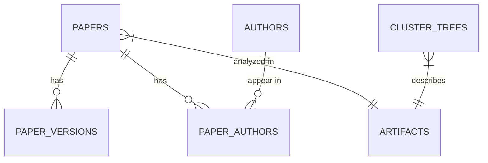

# Database Schema Documentation

## Core Tables

### 1. papers (Core Metadata)

```sql
CREATE TABLE papers (
    id TEXT PRIMARY KEY, -- arXiv paper ID (e.g. "1706.03762")
    title TEXT, -- Paper title
    abstract TEXT, -- Full abstract text
    arxiv_categories TEXT[] NOT NULL, -- Array of arXiv categories (e.g. {'cs.AI','cs.LG'})
    llm_category TEXT, -- AI-generated category (from labeling.py)
    safety_relevance FLOAT, -- 0-1 relevance score to AI safety
    label_confidence FLOAT, -- 0-1 confidence in labeling
    msc_class TEXT, -- Mathematics Subject Classification
    acm_class TEXT, -- ACM classification
    doi TEXT, -- Digital Object Identifier
    license TEXT, -- License information
    comments TEXT, -- Author comments
    created TIMESTAMP, -- Original creation date
    updated TIMESTAMP, -- Last update date
    withdrawn BOOLEAN DEFAULT FALSE,-- Withdrawal status
    created_at TIMESTAMP DEFAULT CURRENT_TIMESTAMP, -- Record creation timestamp
    embedding BYTEA, -- Vector embedding of abstract (added in embeddings.py)
    citation_count INTEGER -- Citation count from OpenCitations (added in citations.py)
);
```

**Indexes:**
- `idx_arxiv_categories` GIN(arxiv_categories) - Array index for fast lookups
- `idx_created` (created)

### 2. paper_versions (Version History)

```sql
CREATE TABLE paper_versions (
    paper_id TEXT, -- References papers.id
    version INTEGER, -- Version number (1-based)
    source_type TEXT, -- Source type (D=direct, I=indirect)
    size TEXT, -- Submission size (e.g. "124kb")
    date TIMESTAMP, -- Version date
    PRIMARY KEY (paper_id, version),
    FOREIGN KEY (paper_id) REFERENCES papers(id)
);
```

### 3. authors (Author Information)

```sql
CREATE TABLE authors (
    id SERIAL PRIMARY KEY, -- Auto-incrementing ID
    keyname TEXT NOT NULL, -- Author's surname
    forenames TEXT, -- Given names
    suffix TEXT, -- Suffix (Jr., III, etc.)
    CONSTRAINT unique_author UNIQUE (keyname, forenames, suffix)
);
```

### 4. paper_authors (Authorship Mapping)

```sql
CREATE TABLE paper_authors (
    paper_id TEXT, -- References papers.id
    author_id INTEGER, -- References authors.id
    author_position INTEGER, -- Order in author list (1-based)
    PRIMARY KEY (paper_id, author_id),
    FOREIGN KEY (paper_id) REFERENCES papers(id),
    FOREIGN KEY (author_id) REFERENCES authors(id)
);
```

**Indexes**:
- `idx_author_particles` (author_id) INCLUDE (paper_id) - Covering index for fast author-based queries

## Analysis Tables (Added in clustering.py)

### 5. artifacts (Clustering Results)

```sql
CREATE TABLE artifacts (
    trial_id INTEGER NOT NULL, -- Clustering trial ID
    paper_id TEXT NOT NULL, -- References papers.id
    umap_embedding BYTEA, -- UMAP-reduced embedding
    cluster_id INTEGER, -- Assigned cluster ID (-1 = noise)
    cluster_prob REAL, -- Cluster membership probability
    PRIMARY KEY (trial_id, paper_id),
    FOREIGN KEY (paper_id) REFERENCES papers(id)
);
```

### 6. cluster_trees (Hierarchy Data)

```sql
CREATE TABLE cluster_trees (
    trial_id INTEGER NOT NULL, -- Clustering trial ID
    parent_cluster_id INTEGER, -- Parent cluster ID
    child_cluster_id INTEGER, -- Child cluster ID
    lambda_val REAL, -- Lambda value for hierarchy
    child_size INTEGER, -- Size of child cluster
    PRIMARY KEY (trial_id, parent_cluster_id, child_cluster_id)
);
```

## Key Relationships

